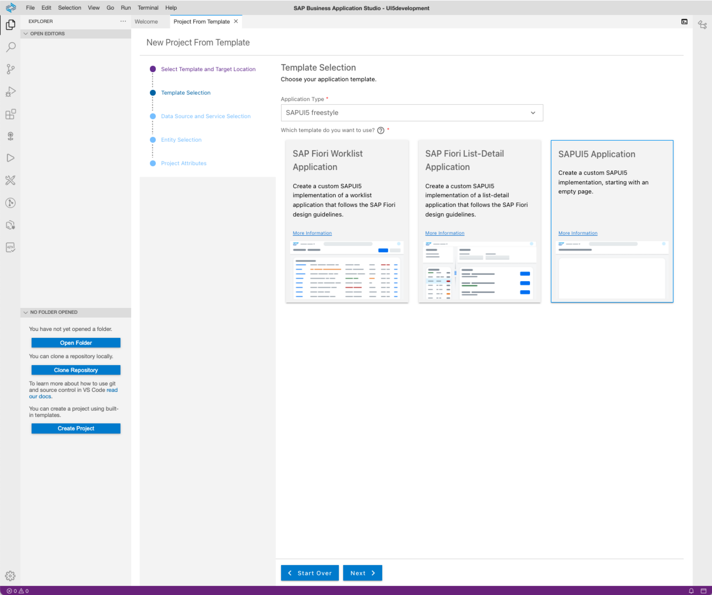
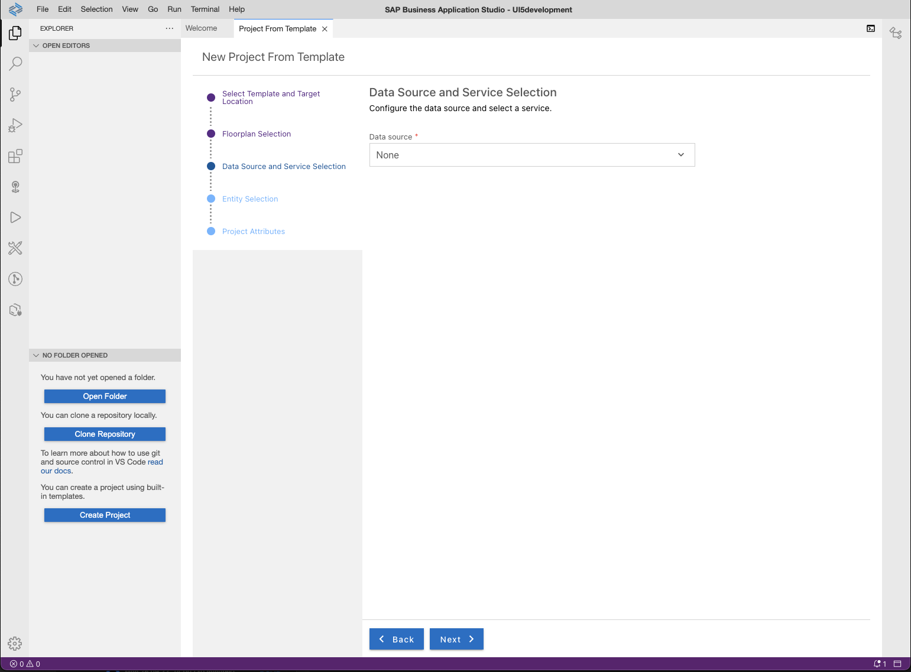
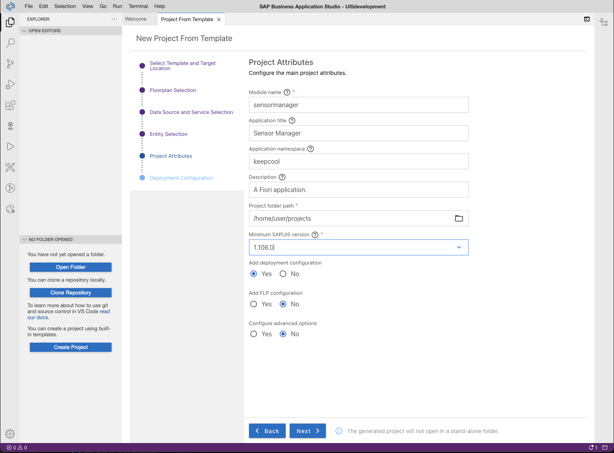
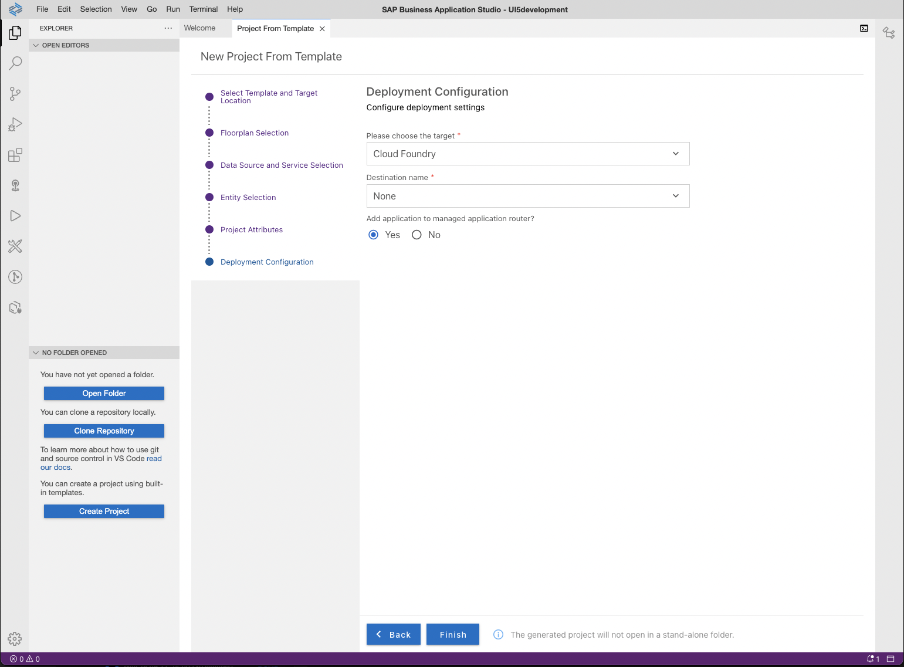
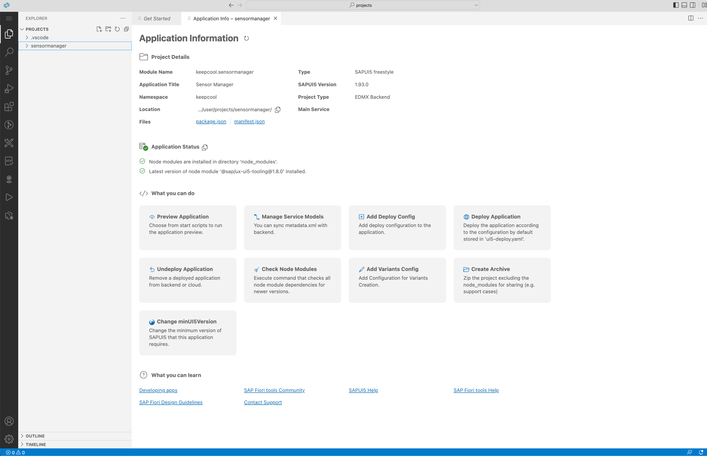
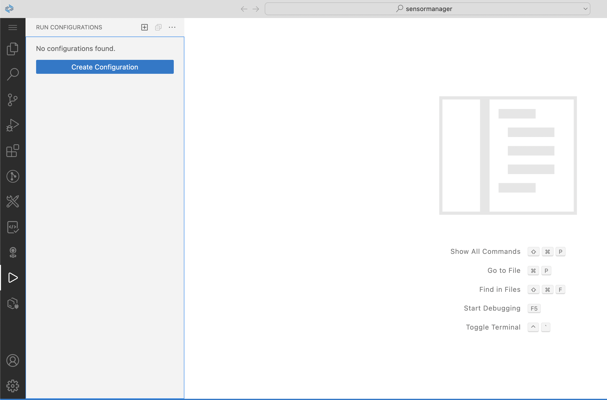
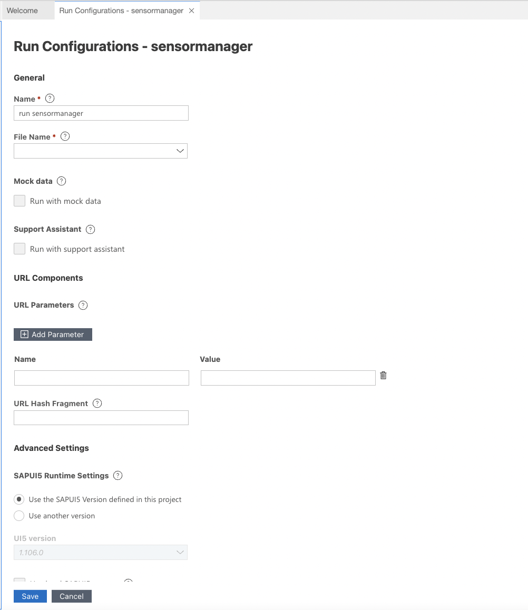

# Exercise 1 - Project Setup Using SAP Business Application Studio

In this exercise you'll create a new UI5 application based on a template provided by SAP Business Application Studio.

## Scenario

Your customer "Keep Cool, Inc." is an operator of several icehouses across the country. Recently, they have been upgraded with new sensors with Internet connection, so that their measuring values are available as a service. To make use of this data and improve their internal workflows, the company asked us to provide an application leveraging this sensor data, visualize it, and provide an overview of the current state of each sensor, so that they can react quickly on any issues.

## Exercise 1.1 - Create a New UI5 Application

After completing these steps you'll have created your first UI5 application.

1. Click on *Files & Folders* on the *Welcome* page to open the workspace */home/user/projects*
    

1. Click on *Start from template* on the *Get Started* page.
    * [Optional] If you have closed the *Get Started* page accidentally, click in the header toolbar on *Help*, and select *Get Started*.</ul>
    

2. Click on *SAP Fiori application* as template and click *Start*.
    

3. Enter the following settings in the *Floorplan Selection* step:
    1. Select *SAPUI5 freestyle* from the dropdown box.
    2. Select *SAPUI5 Application* as application template and click *Next*.</ol>
   <ol>

4. Select *None* as Data Source, since we start without an external data source. Click *Next*
    

5. Enter *App* as view name in the next step. (we don't really select an entity set, since we start without a data service).
    

6. Enter the following settings in the *Project Attributes* step:
    1. Enter *sensormanager* as *Module name*.
    2. Choose *Sensor Manager* as *Application title*.
    3. Enter *keepcool* as your namespace.
    4. You can keep the description default.
    5. Leave the Project folder path as */home/user/projects* .
    6. Select the latest available UI5 release
    7. Select *Add deployment configuration*
    8. Click *Next*. </ol>
   <ol>

7. In the next step, select *Cloud Foundry* as target, leave the Destination name to "None" and make sure that the *Yes* is checked for adding the application to the application router and click *Finish*.  </ul>
    

8. The project is generated, and a notification window appears in the lower right corner which will inform you when the project has been generated. Wait for the message that the project has been generated!

9. Once the project has been generated, the *Application Info* page opens to show you an overview of the project and the list of functions you can do with the project. In addition you can open the menu any time using the command (CTRL + Shift + P) *Fiori: Open application Info*.

    

## Exercise 1.2 - Try out the generated Application

It's time for a first preview of your newly created application!

1. Click the &#9654; icon in the left icon bar, you can now create new configurations to run your application with different parameters.

2. Create a new run configuration by pressing the blue "Create Configuration" button.
    

3. Select *sensormanager* as module to run.
    

4. A new configuration page will open:
    1. Enter *run sensormanager* as *Name*.
    2. Choose *index.html* as *File Name*.
    3. Remove the URL parameter configuration
    4. Press *Save*.
    

5. To start the application by executing the run configuration we just created, press the *play* icon right next to the configuration.
    

5. After a few moments, the application should start up as following:
    

## Summary

Hooray! You've successfully accomplished [Exercise 1 - Project Setup using SAP Business Application Studio](#exercise-1---project-setup-using-sap-business-applicationsstudio)!

Continue to [Exercise 2 - Basic UI5 Configuration and  View Creation](../ex2/README.md).
