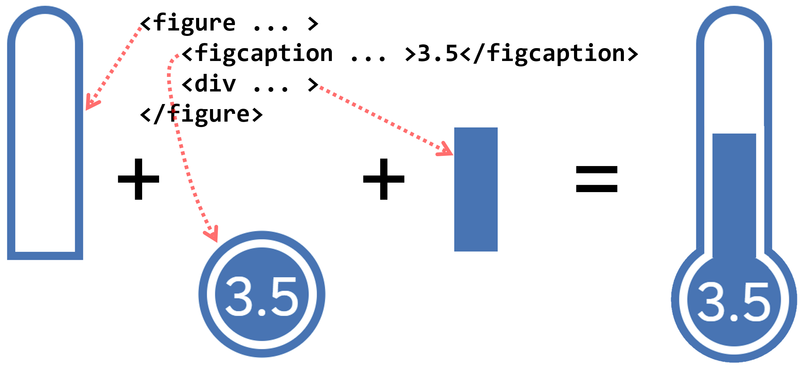

[](../../../../tree/code/ex12)
[](https://SAP-samples.github.io/teched2022-AD163/ex12/sensormanager/webapp/)

# Exercise 10B - Develop your own Control

In this exercise you'll create your own UI5 custom control. Although the color of the thermometer icons shows already the general state in the main page, we want to see the temperature value and the temperature level also displayed graphically. Therefore we create a thermometer control which displays the temperatur with the color and the height of the scale directly.

## Exercise 10B.1 - Create the Custom Control Code

1. Right-click on the `sensormanager/webapp` folder and select `New Folder`. Enter "control" as folder name and confirm.

2. Right-click on this newly created `sensormanager/webapp/control` folder and select `New File`. Enter "Thermometer.js" as file name and confirm.

3. Add the following thermometer control code as content of the newly created `Thermometer.js` file. The control just renders a simple `div` element which contains the temperature value as text. This will be enhanced later.

***sensormanager/webapp/control/Thermometer.js***

````js
sap.ui.define([
	"sap/ui/core/Control"
], function (Control) {
	"use strict";
	return Control.extend("keepcool.sensormanager.control.Thermometer", {
		metadata : {
			properties : {
				value: {type : "float", defaultValue : 0},
				color: {type : "string"}
			}
		},

		renderer : {
			apiVersion : 2,
			render : function (oRM, oControl) {
				if (oControl.getValue()){
					oRM.openStart("div", oControl);
					oRM.class("thermometer-control");
					oRM.openEnd();
					oRM.text(oControl.getValue());
					oRM.close("div");
				}
			}
		}
	});
});
````

4. Open `sensormanager/css/style.css`.

5. Add the css properties for the `div` element which is created by your thermometer control. In the first step it is just a gray square displaying the temperature.

***sensormanager/webapp/css/style.css***

````css
/* Enter your custom styles here */
.thermometer-control {
    width: 50px;
    height: 80px;
    text-align: center;
    color: white;
    background-color: gray;
}
````

6. In the file `Sensors.view.xml`, switch from the icon control to your thermometer control. First define a namespace for the control folder like for a library:

***sensormanager/webapp/view/Sensors.view.xml***

````xml
<mvc:View
    controllerName="keepcool.sensormanager.controller.Sensors"
    xmlns:core="sap.ui.core"
    xmlns:mvc="sap.ui.core.mvc"
    xmlns:grid="sap.ui.layout.cssgrid"
    xmlns:f="sap.f"
    xmlns="sap.m"
    xmlns:cc="keepcool.sensormanager.control"
    displayBlock="true">
    <Page id="page" title="{i18n>title}">

````

6. Replace the icon control with your thermometer control in the view. It will use the same properties as the icon control, but uses a new formatter for the color.

***sensormanager/webapp/view/Sensors.view.xml***

````xml
  <HBox justifyContent="SpaceBetween">
    <VBox justifyContent="SpaceBetween" class="sapUiSmallMarginTop sapUiSmallMarginBegin">
      <Title text="{sensorModel>location}"/>
      <Label text="{i18n>distanceLabel}:"/>
    </VBox>

    <cc:Thermometer
      value="{sensorModel>temperature/value}"
      color="{path: 'sensorModel>temperature/value', formatter:'.formatThermometerColor'}"
      class="sapUiSmallMarginTop sapUiSmallMarginEnd"/>

    <!--core:Icon
      src="sap-icon://temperature"
      color="{path: 'sensorModel>temperature/value', formatter:'.formatIconColor'}"
      size="2.5rem"
      class="sapUiSmallMarginTop sapUiSmallMarginEnd"/-->
  </HBox>
````

7. Open the file `Sensors.controller.js` and add the new formatter, which closely resembles the old one, but returns concrete CSS color values. These values can be written directly to the HTML, while the previously used UI5 icon color values were translated by the icon control.

***sensormanager/webapp/controller/Sensors.controller.xml***

````js
            formatThermometerColor: function(iTemperature) {
                var oThreshold = this.getSensorModel().getProperty("/threshold");
                if (!oThreshold) {
                    return "black";
                } else if (iTemperature < oThreshold.warm) {
                    return "#1873B4"; // less obtrusive than the standard "blue"
                } else if (iTemperature >= oThreshold.warm && iTemperature < oThreshold.hot) {
                    return "orange";
                } else {
                    return "red";
                }
            },
````

8. Reload the preview page and you see the first simple version of your thermometer control. You may have noticed that the calculated color was not yet written to the HTML in the control renderer, so the boxes are all colored the same, as defined in the CSS.

<br><br><br><br>


## Exercise 10B.2 - Beautify your Thermometer Control

Now you want to create a nice looking thermometer, which displays not only the temperature value as number but also using the height of the thermometer scale - with colors.

1. Open `sensormanager/webapp/control/Thermometer.js`.

2. Enhance the code of the renderer to create several HTML elements which will be used to paint a thermometer. We use three HTML elements (one `<figure>`, one `<figcaption>`, one `<div>`) which are styled using CSS and overlaid on top of each other in a way that makes the result look like a nice thermometer.

<br><br><br><br>

***sensormanager/webapp/control/Thermometer.js***

````js
        renderer : {
            apiVersion : 2,
            render : function (oRM, oControl) {
                oRM.openStart("figure", oControl);
                oRM.class("thermometer");
                oRM.style("border", "2px solid " + oControl.getColor());
                oRM.openEnd();

                    oRM.openStart("figcaption");
                    oRM.class("thermometer-value");
                    oRM.style("background-color", oControl.getColor());
                    oRM.style("box-shadow", "0 0 0 2px " + oControl.getColor());
                    oRM.openEnd();
                    oRM.text(oControl.getValue().toFixed(1)); // the temperature value
                    oRM.close("figcaption");

                    oRM.openStart("div");
                    oRM.class("thermometer-level");
                    var temperatureHeight = Math.min(oControl.getValue() * 7, 50) + 5; // values should range from 5 to 55
                    oRM.style("height", temperatureHeight + "px");
                    oRM.style("background-color", oControl.getColor());
                    oRM.openEnd();
                    oRM.close("div");

                oRM.close("figure");
            }
        }
````

3. While some of the CSS properties, like the color and the height of the mercury column, are calculated and have been written by the renderer with the respective current values, most CSS (e.g. for the overall layout information) is static. Now add these static CSS properties to the CSS file of the project. Note how the CSS classes like `thermometer` and `thermometer-value` match those written in the renderer code above.

***sensormanager/webapp/css/style.css***

````css
/* Enter your custom styles here */
.thermometer {
    display: block;
    position: relative;
    box-sizing: border-box;
    width: 18px;
    height: 60px;
    background-color: white;
    border-radius: 10px 10px 0 0;
    margin: 6px;
}

.thermometer-value {
    position: absolute;
    bottom: -22px;
    left: -6px;
    border: 2px solid white;
    width: 22px;
    height: 18px;
    border-radius: 14px;
    color: white;
    font-size: 13px;
    text-align: center;
    padding-top: 4px;
}

.thermometer-level {
    background-color: white;
    box-sizing: border-box;
    position: absolute;
    left: 0;
    bottom: 1px;
    height: 30px;
    width: 14px;
    border-left: 2px solid white;
    border-right: 2px solid white;
}
````

4. Switch to the browser tab where the application preview is opened. Now you see your own custom control displaying the temperature also graphically for every icehouse.
<br><br><br><br>


## Summary

Hooray! You've successfully completed [Exercise 10B - Develop your own Control](../ex10_B/README.md).

Let's take a look at the additional exercises [Additional exercises](../../)

## Further Information
* Developing Controls: https://ui5.sap.com/#/topic/8dcab0011d274051808f959800cabf9f.html
* Walkthrough - Custom Controls: https://ui5.sap.com/#/topic/d12d2ee6a5454d799358d425f9e7c4db
