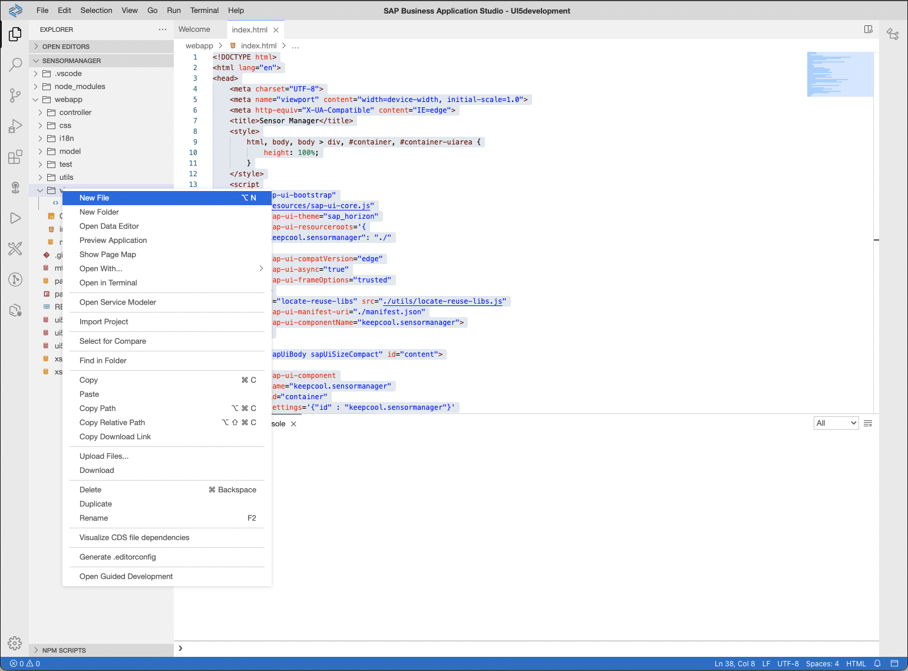
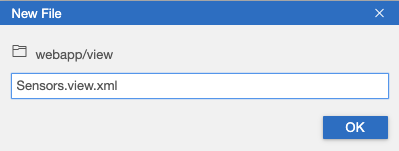
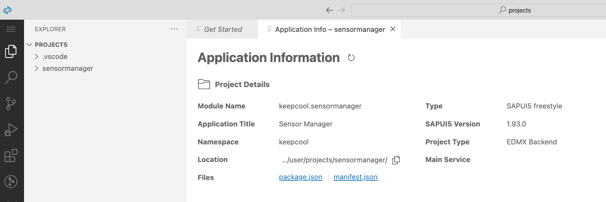

[](../../../../tree/code/ex2)
[](https://SAP-samples.github.io/teched2022-AD163/ex2/sensormanager/webapp/)

# Exercise 2 - Basic UI5 Configuration and View Creation

In this exercise you'll add some content to your application. A new UI5 view showing multiple sensors will be the first part of your app.

## Exercise 2.1 - Check SAP Horizon

SAP Horizon is SAP’s new target design system. It evolves the SAP Fiori design for all SAP products to fully support the Intelligent Suite, running on any device. SAP Business Application Studio by default generates UI5 projects based on SAP Horizon. In your UI5 application the SAP Fiori version is controlled by the UI5 theme.

1. Click on the files icon at the top of the icon bar at the left and open `sensormanager/webapp/index.html`.

2. Check that the attribute `data-sap-ui-theme` has the value `sap_horizon`.

***sensormanager/webapp/index.html***

````html
<!DOCTYPE html>
<html lang="en">
<head>
    <meta charset="UTF-8">
    <meta name="viewport" content="width=device-width, initial-scale=1.0">
    <meta http-equiv="X-UA-Compatible" content="IE=edge">
    <title>Sensor Manager</title>
    <style>
        html, body, body > div, #container, #container-uiarea {
            height: 100%;
        }
    </style>
    <script
        id="sap-ui-bootstrap"
        src="resources/sap-ui-core.js"
        data-sap-ui-theme="sap_horizon"
        data-sap-ui-resourceroots='{
            "keepcool.sensormanager": "./"
        }'
        data-sap-ui-compatVersion="edge"
        data-sap-ui-async="true"
        data-sap-ui-frameOptions="trusted"
    ></script>
    <script id="locate-reuse-libs" src="./utils/locate-reuse-libs.js"
        data-sap-ui-manifest-uri="./manifest.json"
        data-sap-ui-componentName="keepcool.sensormanager">
    </script>
</head>
<body class="sapUiBody sapUiSizeCompact" id="content">
    <div
        data-sap-ui-component
        data-name="keepcool.sensormanager"
        data-id="container"
        data-settings='{"id" : "keepcool.sensormanager"}'
        data-handle-validation="true"
    ></div>
</body>
</html>
````

The sap_horizon is the latest available theme for UI5 development.
To use the new Horizon theme, enable it for your app using data-sap-ui-theme=”sap_horizon” when bootstrapping SAPUI5. Alternatively, use URL parameter …?sap-theme=sap_horizon when launching the app standalone which works for all UI Technologies. The theme IDs are:

* Morning Horizon: sap_horizon
* Evening Horizon: sap_horizon_dark
* High Contrast White: sap_horizon_hcw
* High Contrast Black: sap_horizon_hcb

But for now we will keep the default as set to sap_horizon.

## Exercise 2.2 - Create Sensors.view.xml

After completing these steps you'll have written your first UI5 view. Before creating a new view, let's take a look at the precreated view App.view.xml located under `sensormanager/webapp/view/App.view.xml`.
Replace the content as following:

````xml
<mvc:View
    controllerName="keepcool.sensormanager.controller.App"
    xmlns:mvc="sap.ui.core.mvc"
    displayBlock="true"
    xmlns="sap.m">
	<Shell id="shell">
		<App id="app">
			<pages>
				<Page id="page" title="{i18n>title}">
					<content />
				</Page>
			</pages>
		</App>
	</Shell>
</mvc:View>
````

You just added an *App* control which has a *pages* aggregation. We will make use of this aggregation to add multiple pages for routing later on in this application.

1. To add a new view, rightclick on the `sensormanager/webapp/view` folder and select `New File`.
<br><br><br><br>

2. Enter `Sensors.view.xml` as file name and confirm.
<br><br><br><br>

3. Now we'll add some content to your newly created UI5 view. Let's start with an empty `sap.m.IconTabBar`.

***sensormanager/webapp/view/Sensors.view.xml***

````xml
<mvc:View
    xmlns:mvc="sap.ui.core.mvc"
    xmlns="sap.m"
    displayBlock="true">
    <Page id="page" title="{i18n>title}">
        <content>
            <IconTabBar id="iconTabBar" class="sapUiResponsiveContentPadding">
                <content>
                </content>
            </IconTabBar>
        </content>
    </Page>
</mvc:View>
````

## Exercise 2.3 - Add Dependencies

You will use several UI5 libraries like `sap.m` or `sap.f` in your application. The central point for configuring your UI5 application is the `manifest.json` file, which is located at `sensormanager/webapp/manifest.json`.

1. Click on `manifest.json` link in the *Application Info* page. If you had closed the *Application Info* page, you can reopen it by using command `Fiori: Open Application Info` from command palette.
<br><br><br><br>

2. Go to the section `sap.ui5`.
3. Replace the libraries in the `dependencies/libs` section. UI5 will take care of loading all the libraries listed here when your app is started.

***sensormanager/webapp/manifest.json***

````json
        "dependencies": {
            "minUI5Version": "1.106.0",
            "libs": {
                "sap.ui.core": {},
                "sap.ui.layout": {},
                "sap.m": {},
                "sap.f": {},
                "sap.suite.ui.microchart": {}
            }
        },
````

## Exercise 2.4 - Enable Routing for Sensors.view.xml

UI5 comes with a powerful routing API that helps you control the state of your application efficiently. It takes care of displaying the desired UI5 view based on the given browser URL hash.

Let's adjust the `manifest.json` to enable the routing feature for your newly created view.

1. Click on `manifest.json` link in the *Application Info* page. 
2. Go to the section `sap.ui5`.
3. Replace all content inside the `routing` property with the following content:

***sensormanager/webapp/manifest.json***

````json
        "routing": {
            "config": {
                "routerClass": "sap.m.routing.Router",
                "viewType": "XML",
                "async": true,
                "transition": "slide",
                "viewPath": "keepcool.sensormanager.view",
                "controlAggregation": "pages",
                "controlId": "app"
            },
            "routes": [{
                "name": "RouteSensors",
                "pattern": "",
                "target": ["TargetSensors"]
            }],
            "targets": {
                "TargetSensors": {
                    "viewType": "XML",
                    "transition": "slide",
                    "clearControlAggregation": false,
                    "viewId": "Sensors",
                    "viewName": "Sensors"
                }
            }
        }
````

4. Open the tab with the application preview and reload it. The application is being updated, and you can see an empty `sap.m.IconTabBar`.
  * [Optional] If you have closed the tab with the application preview accidentally, click in the header toolbar on *View* and then select *Find Command...*. Enter here *Ports: Preview* and confirm. A new tab with the application preview opens.</ul>
<br><br><br><br>

## Summary

You've now enabled routing for your application and prepared your application for further development. Stay tuned!

Continue to [Exercise 3 - Show Sensor Content](../ex3/README.md).


## Further Information

* UI5 Demokit: https://ui5.sap.com/
* Views in UI5: https://ui5.sap.com/#/topic/91f27e3e6f4d1014b6dd926db0e91070
* Routing in UI5: https://ui5.sap.com/#/topic/3d18f20bd2294228acb6910d8e8a5fb5
* SAP Fiori 3: https://experience.sap.com/fiori-design-web/sap-fiori/#sap-fiori-3
