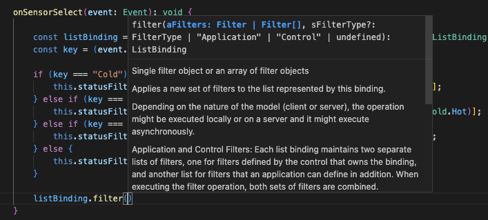

[](sensormanager)
[](https://SAP-samples.github.io/teched2022-AD163/TypeScript/exercises/ex6/sensormanager/webapp/)

# Exercise 6 - Filtering With the IconTabBar

As your customer needs the full overview to make decisions quickly, you will give them an option to narrow down the list of sensors based on the current sensor temperature.

## Exercise 6.1 - Add new IconTabFilters to the Sensors.view.xml

For this, we enhance our `sap.m.IconTabBar` control.

1. Open `sensormanager/webapp/view/Sensors.view.xml`.

2. Add `sap.m.IconTabFilter` elements to the `items` aggregation of the `sap.m.IconTabBar` control. They will be visible as icons above the bar, so that the user can click them to filter the list.

***sensormanager/webapp/view/Sensors.view.xml***

````xml
            <IconTabBar id="iconTabBar" class="sapUiResponsiveContentPadding">
                <items>
                    <IconTabFilter showAll="true" text="{i18n>msgFilterAll}" key="All"/>
                    <IconTabSeparator/>
                    <IconTabFilter icon="sap-icon://fridge" iconColor="Default" text="{i18n>msgFilterCold}" key="Cold"/>
                    <IconTabFilter icon="sap-icon://blur" iconColor="Critical" text="{i18n>msgFilterWarm}" key="Warm"/>
                    <IconTabFilter icon="sap-icon://warning" iconColor="Negative" text="{i18n>msgFilterHot}" key="Hot"/>
                </items>
                <content>
                ...
````

3. Let's see if your UI5 application now displays the newly introduced `sap.m.IconTabFilter` elements! Switch to the browser tab with the opened application preview and reload the page.
<br><br><br><br>

## Exercise 6.2 - Implement the Filtering

In the previous section you've added all necessary controls. Next, you'll implement the filtering logic.

1. Open `sensormanager/webapp/controller/Sensors.controller.ts`.

2. Implement the `onSensorSelect` function for filtering the sensor list items by checking their `status` property. We'll also make use of the previously defined threshold and use some filter settings to narrow down the result. `LT` for example means "less than".

***sensormanager/webapp/controller/Sensors.controller.ts***

````js
    private customFilters: Filter[] = [];
    private statusFilters: Filter[] = [];

    onSensorSelect(event: Event): void {

        const listBinding = this.getView()?.byId("sensorsList")?.getBinding("items") as ListBinding;
        const key = (event.getParameter("key") as string);

        if (key === "Cold") {
            this.statusFilters = [new Filter("temperature", "LT", Threshold.Warm, false)];
        } else if (key === "Warm") {
            this.statusFilters = [new Filter("temperature", "BT", Threshold.Warm, Threshold.Hot)];
        } else if (key === "Hot") {
            this.statusFilters = [new Filter("temperature", "GT", Threshold.Hot, false)];
        } else {
            this.statusFilters = [];
        }

        listBinding.filter(this.statusFilters);
    }
````

You can again make use of the *quickfix* functionality on hover to add the missing import modules. Note that for `Filter` there are two modules available that will be recommended:
- `sap/ui/model/Filter`
- `sap/ui/model/odata/Filter`

Chose the `sap/ui/model/Filter` option, as this application is using a JSONModel.

Knowledge about the DOM types like Event is built-in to TypeScript (note: there is no import in the file for the "Event" type so far!). Due to the name equality, TypeScript assumes the DOM Event class is meant. This is something to keep in mind when dealing with types which have very generic and common names.

You can simply override by explicitly importing the UI5 Event class. Add the following line to the beginning of the file to get rid of the error:

````js
import Event from "sap/ui/base/Event";
````

Please also try to type the last line of this code block manually: `listBinding.filter(this.statusFilters);` and avoid to copy paste the last line. 
This way another advantage of TypeScript can be seen here, as there is a type ahead available for available methods on the given object type:

<br><br><br><br>

There is also direct access available to the documentation:

<br><br><br><br>

## Exercise 6.3 - Assign the Filtering to the IconTabBar

The filtering logic has been written. Next, you need to assign the filtering function to the `select` event of the `sap.m.IconTabBar`.

1. Open `sensormanager/webapp/view/Sensors.view.xml`.

2. Bind the `onSensorSelect` function to the `select` event of the `IconTabBar`. Whenever one of the `sap.m.IconTabFilter` elements is clicked, this function will be called.

***sensormanager/webapp/view/Sensors.view.xml***

````xml
            <IconTabBar id="iconTabBar" select=".onSensorSelect" class="sapUiResponsiveContentPadding">
````

3. Let's see if your UI5 application is now able to filter the sensor data correctly. Switch to the browser tab with the opened application preview and reload the page. Click the *Too Hot* icon. Only sensors with too high a temperature are displayed.
<br><br><br><br>

## Exercise 6.4 - Display the Total Number of Sensors in Every IconTabFilter

Your customer wishes to display the total number of sensors as well. For this, you can introduce the `count` property of `sap.m.IconTabFilter`.

1. Open `sensormanager/webapp/view/Sensors.view.xml`.

2. Make use of an expression binding by adding the `count` property and the expression binding `{=${sensorModel>/sensors}.length}`.

***sensormanager/webapp/view/Sensors.view.xml***

````xml
                    <IconTabFilter
                        showAll="true"
                        text="{i18n>msgFilterAll}"
                        key="All"
                        count="{=${sensorModel>/sensors}.length}"/>
````

3. Let's see if your UI5 application can display the total number of sensors correctly. Switch to the browser tab with the opened application preview and reload the page. Do you see *100*? Yeah!
<br><br><br><br>

## Summary

Hooray! You've successfully completed [Exercise 6 - Filtering with the IconTabBar](#exercise-6---filtering-with-the-icontabbar).

Continue to [Exercise 7 - Fragment containing a SelectDialog](../ex7/README.md).

## Further Information

* Model Filter in UI5: https://ui5.sap.com/#/topic/5295470d7eee46c1898ee46c1b9ad763
* Expression Binding: https://ui5.sap.com/#/topic/daf6852a04b44d118963968a1239d2c0
